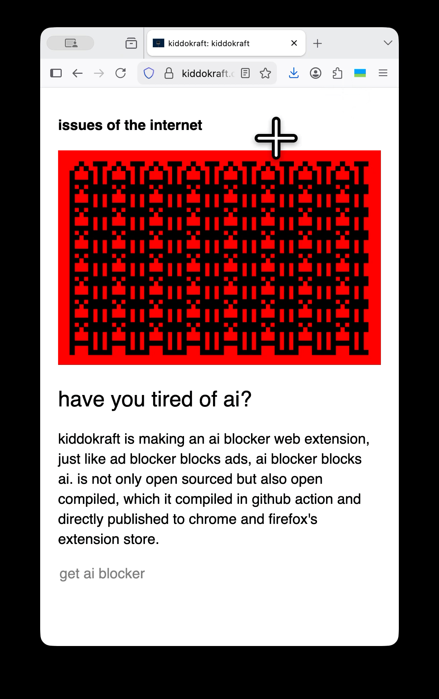

# bye bye ai.

ai blocker by kiddokraft is a web extension blocks ai relate content.

### download for firefox

[firefox add-on](https://addons.mozilla.org/firefox/addon/ai-blocker-by-kiddokraft/)

### download for chrome

[if donation exceed 5 usd, kiddokraft can get pay $5 chrome Developer fee to get extension listed in chrome web store](https://liberapay.com/kiddokraft/donate)

### download for safari

[if donation exceed 100 usd, kiddokraft can get pay $100 apple developer fee to get extension listed in apple app store](https://liberapay.com/kiddokraft/donate)

### how it works

#### add keywords to block
add any word to "follow the current trend and feel no fomo".

#### highlighting in debug mode
highlighting is the most satisfy way to to see what is been blocked.

#### semantic blocking
 semantic blocking checks what is parallel in dom tree and blocking the entire component.

## build your self
check package.json for build instruction.
